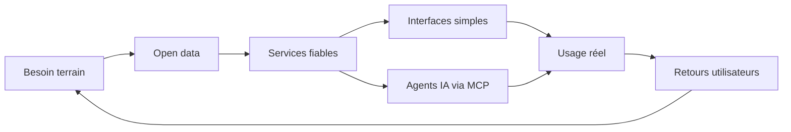

<div align="center">


### Builder open data à Clermont-Ferrand

Je transforme des besoins terrain en outils utiles, maintenus et utilisés.
<br />Basketball français, transport local, infra self-hosted et agents IA.

<br />

<a href="https://hoops63.desimone.fr"></a>
<a href="https://gerzatlive.desimone.fr"></a>
<a href="https://github.com/nickdesi/FFBB-MCP-Server"></a>

<br /><br />


</div>

---

## 🔗 Navigation rapide

[Projets phares](#-projets-phares) • [Ma boucle](#-ma-boucle-de-construction) • [Stack](#-stack-du-moment) • [Stats](#-stats) • [Contact](#-contact)

---

## 👋 En bref

```
📍 Localisation    Clermont-Ferrand, Auvergne
🏀 Terrain         Basketball amateur, clubs, bénévoles, transport local
🎯 Approche        Simple, fiable, exploitable en production
🔧 Focus           MCP, open data, TypeScript, Python, self-hosted
```

> Je ne construis pas des démos pour faire joli. Je construis des petits produits qui répondent à un vrai irritant et qui restent utiles après le premier lancement.

---

## 🚀 Projets phares

<div align="center">

| | 🏀 **FFBB MCP Server** | 🚌 **Gerzat Live** |
|:---:|:---|:---|
| **Quoi** | Premier serveur MCP connecté aux données FFBB | Transport temps réel hyperlocal pour Gerzat |
| **Détails** | Scores, classements, calendriers, clubs, salles et bilans d'équipes directement depuis un agent IA | Départs bus T2C, trains TER, carte live E1, favoris, PWA et indicateurs de fraîcheur |
| **Stack** | `Python` `MCP` | `TypeScript` `Next.js` |
| **Liens** | [Repo](https://github.com/nickdesi/FFBB-MCP-Server) | [Repo](https://github.com/nickdesi/BusTrainGerzat) • [App](https://gerzatlive.desimone.fr) |

| | 🏗️ **FFBB Data Client** | 🛡️ **unbound-adguard-installer** |
|:---:|:---|:---|
| **Quoi** | Client officieux pour structurer l'accès à l'API FFBB | DNS souverain en une commande |
| **Détails** | Le socle technique pour explorer compétitions, organismes, équipes et résultats | Unbound + AdGuard Home : résolution récursive et filtrage pubs/trackers, sans cloud |
| **Stack** | `Python` | `Shell` `Self-hosted` |
| **Liens** | [Repo](https://github.com/nickdesi/ffbb-data-client) | [Repo](https://github.com/nickdesi/unbound-adguard-installer) |

</div>

---

## 🧭 Ma boucle de construction



- Outils pour les bénévoles, les clubs et les usages locaux
- Intégrations propres autour de données publiques parfois difficiles à exploiter
- Interfaces sobres, rapides et compréhensibles
- Self-hosted quand ça améliore la maîtrise et la confidentialité

---

## 🧰 Stack du moment

<div align="center">

| Langages | Frameworks | IA & Agents | Infra |
|:---:|:---:|:---:|:---:|
| <br /> | <br /> |  | <br /><br /><br />

</div>

---

## 📊 Stats

<div align="center">


<br />


<br /><br />


</div>

---

<div align="center">

### Open data utile. Infra maîtrisée.

*Construit depuis Clermont-Ferrand, avec du café et quelques vrais problèmes à résoudre.*

<br />

<a href="https://github.com/nickdesi"></a>
<a href="https://gerzatlive.desimone.fr"></a>
<a href="https://hoops63.desimone.fr"></a>

<br /><br />


</div>
