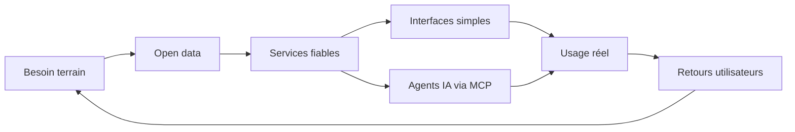

<div align="center">


<h3>Builder open data à Clermont-Ferrand</h3>
<p>
  Je transforme des besoins terrain en outils utiles, maintenus et utilisés.<br />
  Basketball français, transport local, infra self-hosted et agents IA.
</p>

<a href="https://hoops63.desimone.fr"></a>
<a href="https://gerzatlive.desimone.fr"></a>


</div>

<div align="center">
  
</div>

---

## 👋 En bref

```text
Localisation    Clermont-Ferrand, Auvergne
Terrain         Basketball amateur, clubs, bénévoles, transport local
Approche        Simple, fiable, exploitable en production
Focus           MCP, open data, TypeScript, Python, self-hosted
```

Je ne construis pas des démos pour faire joli. Je construis des petits produits qui répondent à un vrai irritant et qui restent utiles après le premier lancement.

---

## 🚀 Projets phares

<table>
  <tr>
    <td width="50%">
      <h3>🏀 FFBB MCP Server</h3>
      <p><strong>Premier serveur MCP connecté aux données FFBB.</strong></p>
      <p>Scores, classements, calendriers, clubs, salles et bilans d'équipes directement accessibles depuis un agent IA.</p>
      <p><a href="https://github.com/nickdesi/FFBB-MCP-Server">Repository</a></p>
      
      
    </td>
    <td width="50%">
      <h3>🚌 Gerzat Live</h3>
      <p><strong>Transport temps réel hyperlocal pour Gerzat.</strong></p>
      <p>Départs bus T2C, trains TER, carte live E1, favoris, PWA et indicateurs de fraîcheur.</p>
      <p><a href="https://github.com/nickdesi/BusTrainGerzat">Repository</a> · <a href="https://gerzatlive.desimone.fr">Application</a></p>
      
      
    </td>
  </tr>
  <tr>
    <td width="50%">
      <h3>🏗️ FFBBApiClientV3</h3>
      <p><strong>Client officieux pour structurer l'accès à l'API FFBB v3.</strong></p>
      <p>Le socle technique utilisé pour explorer compétitions, organismes, équipes et résultats.</p>
      <p><a href="https://github.com/nickdesi/FFBBApiClientV3">Repository</a></p>
      
    </td>
    <td width="50%">
      <h3>🛡️ unbound-adguard-installer</h3>
      <p><strong>DNS souverain en une commande.</strong></p>
      <p>Unbound pour la résolution récursive, AdGuard Home pour filtrer pubs et trackers, sans dépendance cloud.</p>
      <p><a href="https://github.com/nickdesi/unbound-adguard-installer">Repository</a></p>
      
      
    </td>
  </tr>
</table>

---

## 🧭 Ma boucle de construction



- Outils pour les bénévoles, les clubs et les usages locaux
- Intégrations propres autour de données publiques parfois difficiles à exploiter
- Interfaces sobres, rapides et compréhensibles
- Self-hosted quand ça améliore la maîtrise et la confidentialité

---

## 🧰 Stack du moment

<div align="center">


</div>

---

## 📊 GitHub

<div align="center">
  
  
</div>

<div align="center">
  
</div>

---

<div align="center">
  <strong>Open data utile. Basket de terrain. Infra maîtrisée.</strong><br />
  <sub>Construit depuis Clermont-Ferrand, avec du café et quelques vrais problèmes à résoudre.</sub>
</div>

<br />


